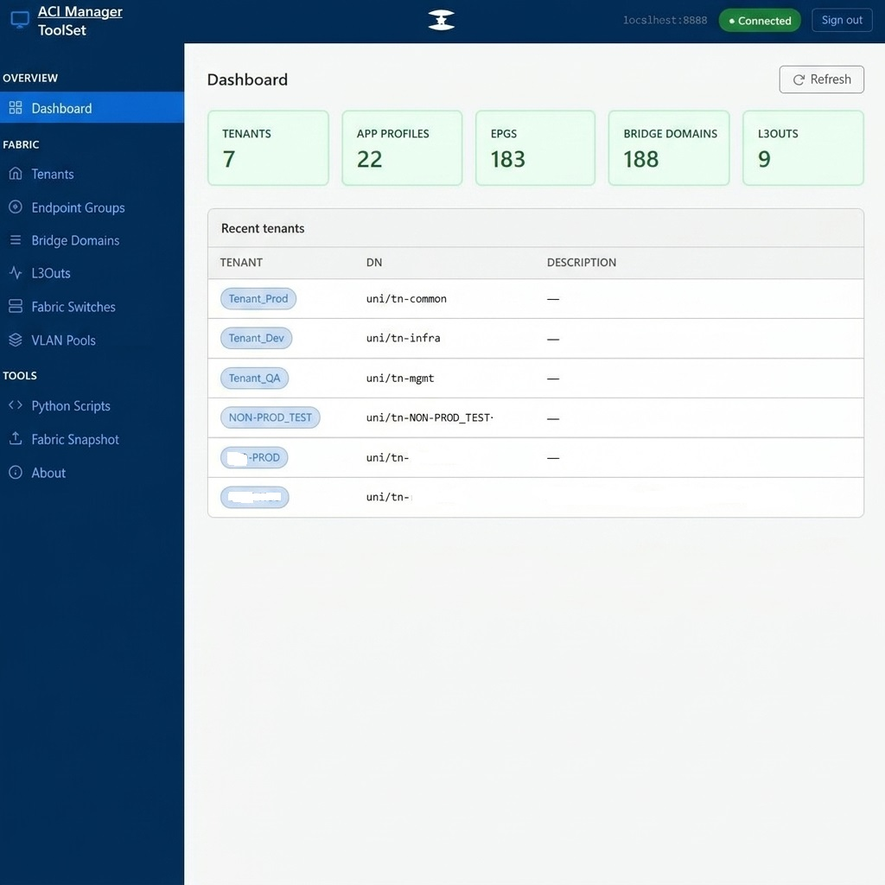

# ACI Manager (ToolSet)

A modern, web-based management dashboard and automation toolset for Cisco ACI (Application Centric Infrastructure) fabrics. Designed to simplify administration, configuration, and monitoring of ACI environments through a clean, intuitive, and responsive single-page user interface.



---

## Key Features

### 📊 Dashboard
- Real-time connectivity status to your Cisco APIC controller.
- Visual counters of ACI fabric components: Tenants, Application Profiles, EPGs, Bridge Domains, L3Outs, Switches, VLAN Pools, and Snapshots.

### 🌐 Fabric Management
- **Interface Profiles**: Center-aligned, simplified form to configure interface profiles (`infraAccPortP`) and port selectors (`infraHPortS`). 
  - Features an **Interface Profile Name dropdown** dynamically populated with existing interface profiles configured in the fabric.
  - Supports inline creation of new profiles via the `[Create New Interface Profile...]` option.
  - Allows mapping custom port blocks (Card, From Port, To Port) to Access Port (`infraAccPortGrp`) or VPC Bundle (`infraAccBndlGrp`) policy groups, including inline creation of new policy groups with Attachable Access Entity Profile (`infraAttEntityP`) linkage.
- **VLAN Pools**: Monitor configured VLAN ranges, allocation modes (static/dynamic), and provision new VLAN pools instantly.
- **Fabric Switches**: Monitor leaf switches and inspect physical interfaces, admin state, and link status. Spine switches are excluded to keep management focused on Leaf access ports.

### 🛠️ Advanced Tools & Automation
- **Fabric Snapshot (Backup)**:
  - Clean, simplified, and centered form to trigger configuration backups immediately (using ACI's `configExportP` class).
  - Export to **Local (Snapshot)** rollback points on the APIC or to a **Remote Export Destination** (SFTP, SCP, FTP).
  - Integrates existing ACI **Remote Locations** (class `fileRemotePath`) in a dropdown list to automatically populate routing and routing credentials, preventing duplicate configurations.
  - Supports custom TCP/SSH Ports and **Management Routing EPGs** (Out-of-Band vs. In-Band) via `fileRsARemoteHostToEpg` to guarantee correct routing for SSH/TCP connections.
- **EPG Static Port Binding**: Map specific leaf switch physical ports directly to Endpoint Groups.
- **Python Script Library**: Ready-to-use scripts (Create EPG, Create BD) for REST API automation, organized in collapsible accordion cards.
- **About**: Version information (`v1.1.0`) and system details.

---

## Architecture & Technology Stack

- **Frontend**: Clean HTML5 structure styled with Vanilla CSS and interactive Javascript. It communicates directly with ACI's REST API.
- **CORS Proxy / Local Server (`aci-proxy.py`)**: A lightweight HTTP and CORS proxy server written in Python. It serves the static HTML application locally and forwards API calls to the APIC, bypassing browser CORS restrictions.

---

## Getting Started

### Prerequisites
- Python 3.x
- Access to a Cisco ACI APIC controllers. (Tested for versions 4.2 - 5.3(2))

### Configuration
1. Clone the repository to your local directory.
2. Edit the `.env` file in the root directory with dummy APIC credentials and target URL:
   ```env
   APIC_URL=https://your-apic-domain-or-ip
   APIC_USERNAME=your-username
   APIC_PASSWORD=your-password
   APIC_VERIFY_SSL=false
   ```
3. (Optional) Edit the `TARGET` variable in `aci-proxy.py` to match your APIC URL.

### Running the App
Start the local proxy development server:
```bash
python aci-proxy.py
```

Open your browser and navigate to:
**`http://localhost:8888`**

---

## License

This software is distributed under the **ACI Manager (ToolSet) Limited Use License**:
- **Personal Use**: Free for private, personal, hobbyist, and educational use.
- **Corporate & Commercial Use**: A paid commercial license is required for any use by companies, corporations, partnerships, or government agencies. Please contact the copyright holder to obtain a commercial license.

For detailed terms, please see the [LICENSE](LICENSE) file.
